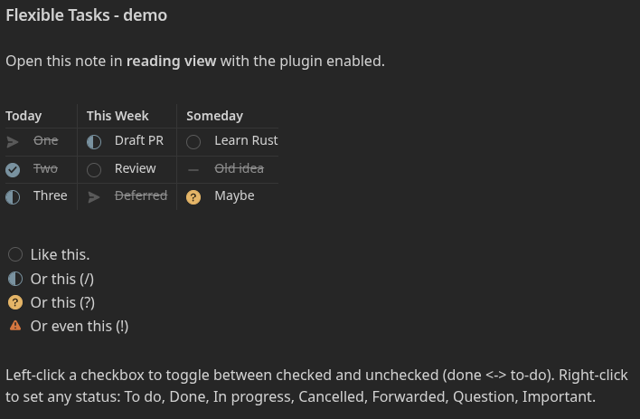

# Flexible Tasks - demo

Task checkboxes don't work inside Markdown table cells: the format treats a cell
as inline-only, so `- [ ] One` written in a cell is dead text - Obsidian (and
GitHub, as you can see if you view the raw source) never turn it into a checkbox.
**Flexible Tasks** fixes that in Obsidian.

## What it looks like in Obsidian

Here's a project board where every table cell is a real, clickable checkbox, with
an ordinary list below it - all rendered with the [Minimal](https://minimal.guide/)
theme:



**Left-click** a checkbox to toggle done/to-do; **right-click** to set any status.
The status icons are drawn by your checkbox theme (shown here with Minimal) - a
different theme will render them differently.

## What you write

The source is just ordinary task syntax placed inside table cells:

```markdown
| Today       | This Week      | Someday          |
| :---------- | :------------- | :--------------- |
| - [ ] One   | - [/] Draft PR | - [ ] Learn Rust |
| - [x] Two   | - [ ] Review   | - [-] Old idea   |
| - [/] Three | - [>] Deferred | - [?] Maybe      |
```

Flexible Tasks renders each `- [status]` as an interactive checkbox and writes
your changes back to the file. The status character round-trips faithfully - a
`[/]` stays `[/]` unless you change it.

## Statuses

| Marker | Meaning     |
| :----- | :---------- |
| `[ ]`  | To do       |
| `[x]`  | Done        |
| `[/]`  | In progress |
| `[-]`  | Cancelled   |
| `[>]`  | Forwarded   |
| `[?]`  | Question    |
| `[!]`  | Important   |

Any other single character works too, and shows with the **Important** indicator
so an unplanned status stands out instead of quietly looking done.
